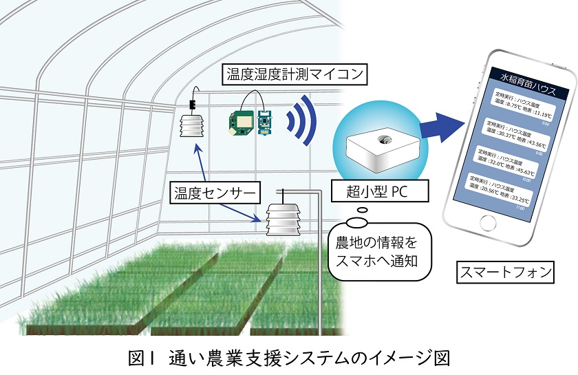

# LINE Notify サービス終了に伴う代替手段のお知らせ

　LINE Notify終了に伴い、他のメッセージアプリを利用した代替手段に対応した配布プログラムを公開しております。
 
　2025年3月19日にDiscordに対応いたしました。📁program_for_discordに入っております各プログラムをご利用ください。なお、利用手順については、通い農業支援システム制作マニュアルの公開ページの下部「ファイルダウンロード」より、「代替手段のお知らせ」をダウンロードしご利用ください。

通い農業支援システム制作マニュアル公開ページ

https://www.naro.go.jp/publicity_report/publication/pamphlet/tech-pamph/142629.html

# 通い農業支援システム

　本ページは農研機構東北農業研究センターが、農林水産省委託事業「原発事故からの復興のための放射性物質対策に関する実証研究委託事業」によって開発したハウス遠隔監視システム「通い農業支援システム」の配布プログラム公開ページです。

　本システムはモジュール化された簡便なIoT機器を利用して、離れたハウスの温度等をスマホで遠隔監視できるようにするハウス遠隔監視システムです。

　ハウスごとに通信機能付きマイコンと温度センサを設置して遠隔監視システムを構築するには、IoTに関する知識やWEBサーバの構築またはクラウドサービスの契約が必要であり、容易には作成できません。そこで、データ取得用・メッセージ通知用のWeb APIを利用することで、一定の知識があれば利用できる、ハウス温度等の遠隔監視を簡便に実現するシステムを提案しています。

　本システムでは「温度等のデータを定期通知」、「しきい値を超えた際の警報通知」、「日平均値・最大値・最小値の通知」、「グラフでの通知」といった機能を持つハウス遠隔監視システムを作成できます。
 
 # 導入方法について

　導入方法についてのマニュアルは農研機構のホームページで公開しております。よく問い合わせのある内容を追加し、制作マニュアルをアップデートしたものが標準作業手順書となります。

・安価かつ簡便に ハウスの遠隔監視に使える IoT機器「通い農業支援システム」 製作マニュアル

https://www.naro.go.jp/publicity_report/publication/pamphlet/tech-pamph/142629.html

・安価かつ簡便にハウス環境を遠隔監視できる通い農業支援システム標準作業手順書

https://sop.naro.go.jp/document/detail/106

 # 資材の入手先について
 
　安価かつ簡便にハウス環境を遠隔監視できる通い農業支援システム標準作業手順書にて、商品名等を記載しておりますが、入手先が不明な場合はお問い合わせ下さい。

 # 使用上の注意

　本プログラムはプロトタイプ（β版）です。Python3.7.3、Numpy1.20.1、Pandas1.2.2、Matplotlib3.3.4で動作確認しておりますが、ご使用になられる環境での動作保証はいたしておりません。

　本プログラムを使用したことにより発生したいかなる損害に対して、農研機構は責任を負いません。また、本プログラムを用いて作成した「通い農業支援システム」は、自己の責任において製作・利用する遠隔監視するシステムです。本システムを用いて生じた故障又は損害等に関しては一切の責任を負いかねますのでご了承ください。

　また、本プログラムの商業的な利用又は配布に関しては連絡してください。

　通い農業支援システムに関するご質問、支援要請等については
　http://www.naro.affrc.go.jp/laboratory/tarc/inquiry/index.html
 までお願いします。
